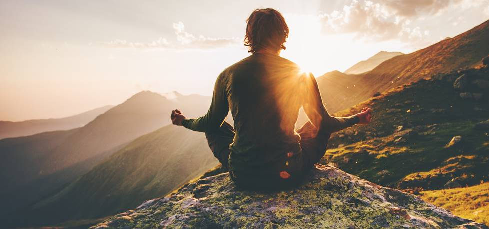

Semana passada, me peguei rindo de uma memória recente. Foi na conversa pré-matrimonial com o padre, no mês passado. Minha esposa, católica praticante, ao meu lado. O padre, com seu formulário, fazendo as perguntas de praxe. Tudo corria bem até ele chegar naquela questão aparentemente simples: "Qual sua religião?"

"Não tenho religião", respondi tranquilamente.

O silêncio que se seguiu foi quase cômico. Vi o padre olhar para o papel, depois para mim, depois para o papel novamente. A caneta parada no ar. Aquele campo do formulário, tão simples de preencher para a maioria, havia se tornado um enigma existencial materializado em burocracia eclesiástica.

"Mas... você acredita em Deus?", ele tentou.

"Sim, acredito, mas não no Deus que vocês acreditam."

Mais silêncio. A caneta continuava suspensa.

"Então você é ateu?", nova tentativa.

"Não, acabei de dizer que acredito em Deus", respondi, tentando não rir.

Foi quando percebi que estávamos presos num ciclo de incompreensão mútua. O padre precisava preencher aquele campo, e eu não cabia em nenhuma das caixinhas disponíveis.

"Coloca aí 'cristão'", sugeri finalmente, com um meio sorriso. "Cresci evangélico, estou casando na igreja católica, conheço a história. Serve?"

O alívio no rosto dele foi visível. A caneta finalmente tocou o papel.

## O despertar sem religião

Sam Harris, neurocientista e filósofo, em seu livro "Waking Up: A Guide to Spirituality Without Religion", descreve exatamente esse dilema. Ele argumenta que cerca de um quarto da população se identifica como "espiritual mas não religiosa" - uma proposição que parece paradoxal mas que captura uma verdade fundamental: é possível ter experiências transcendentes, cultivar compaixão profunda e encontrar significado sem abraçar dogmas religiosos.

Harris conta sobre uma experiência que teve aos 16 anos, num retiro espiritual que, ao invés de iluminação, trouxe apenas frustração. Mas foi justamente essa frustração que o lançou numa jornada de descoberta. Anos depois, experimentando estados alterados de consciência, ele teve uma percepção que mudaria sua vida: o amor, em sua forma mais pura, é impessoal e universal. Não é transacional - "eu te amo porque..." - mas sim um estado de ser.

Como ele mesmo escreve:

> "O amor estava - como advertido por místicos através das eras - sendo um estado de ser. Como não havíamos visto isso antes?"

## A ilusão do eu separado

Cresci na igreja evangélica. Daquelas bem tradicionais, com escola dominical, acampamentos e a certeza absoluta de que nosso caminho era o único correto. Foi lá que aprendi sobre comunidade, sobre valores, sobre a importância de algo maior que nós mesmos. Mas também foi lá que vi as primeiras barreiras sendo erguidas - nós e eles, salvos e perdidos, certo e errado.

Com o tempo, minha curiosidade natural me levou a questionar: se existe um Deus, por que Ele se revelaria apenas para um grupo específico, numa região específica, numa época específica?

## A jornada pelos caminhos

Aos 29 anos, depois de transitar por tantos caminhos espirituais, aprendi que cada tradição carrega pedaços de uma verdade maior. Mergulhei no budismo e descobri a meditação. Estudei o espiritismo e me fascinou a ideia de evolução contínua da consciência. Estudei umbanda e vi uma conexão com o sagrado que transcendia preconceitos. Vi sobre o Alcorão e encontrei poesia onde muitos veem apenas rigidez.

Sabe aquele ditado popular: "Todos os caminhos levam à Roma", para mim podemos usa-la para: Todos os caminhos levam à Deus. Cada um tem sua jornada espiritual que quase sempre é influenciada pela época e local que você vive e a religião dos seus pais. Creio que não exista o caminho certo, que o importante é sentir a conexão com algo muito maior que nós, é olhar o mundo como sua própria expressão. É perceber que estamos aqui para viver e experimentar a vida da melhor forma.

## Os mestres revolucionários

Aqui vai uma ironia que sempre me faz refletir: Jesus não era cristão. Buda não era budista. Muhammad não fundou o islamismo pensando em criar uma religião institucionalizada. Esses mestres eram revolucionários espirituais que questionavam as estruturas religiosas de sua época.

Jesus andava com coletores de impostos e prostitutas, quebrando todas as regras sociais e religiosas. Buda abandonou os extremos do ascetismo e do hedonismo para encontrar o caminho do meio. Nenhum deles diria "minha religião é a única verdadeira" - isso foi invenção de quem veio depois, de quem precisava de poder, controle, identidade grupal.

Como Harris aponta, as religiões institucionalizadas muitas vezes perdem de vista essas verdades essenciais, presas em "doutrinas ridículas e divisivas" como a ideia de que não-crentes serão punidos eternamente. Ele argumenta que podemos preservar o que há de valioso - amor, compaixão, bondade moral, auto-transcendência - sem abraçar ficções aterrorizantes e degradantes.

## O presente como portal

"A realidade da sua vida é sempre agora", escreve Harris. "E perceber isso é libertador." Esta é talvez a percepção mais importante: a maioria de nós passa a vida buscando felicidade e segurança sem reconhecer o propósito subjacente dessa busca. Estamos todos procurando um caminho de volta para o presente, tentando encontrar razões suficientemente boas para estarmos satisfeitos agora.

Minha espiritualidade hoje é sobre isso: presença. Medito pela manhã, não porque algum livro sagrado mandou, mas porque descobri que começar o dia em silêncio me conecta com algo essencial. Leio textos sagrados de várias tradições como quem conversa com velhos sábios, cada um oferecendo sua perspectiva única sobre o mistério da existência.

O Deus em que acredito - esse Deus de Espinoza, essa consciência universal que Neale Donald Walsch descreve - não está sentado num trono julgando nossas ações. É a própria teia da existência, o campo de consciência do qual todos emergimos e ao qual todos retornamos. Somos ondas no oceano, temporariamente esquecidas de que somos também o próprio oceano.

## Além das caixinhas

Quando acompanho minha esposa na missa, não vou por obrigação, mas por amor e respeito. E encontro beleza ali - na comunhão, no silêncio compartilhado, nas histórias milenares que ainda ecoam. Vou para escutar a palavra e ouvir sua sabedoria. Não preciso acreditar na transubstanciação literal para reconhecer o poder transformador do ritual compartilhado.

Harris fala sobre isso também:

> A espiritualidade deve ser distinguida da religião porque pessoas de todas as fés, e de nenhuma, tiveram os mesmos tipos de experiências espirituais. O sentimento de dissolução do ego, a experiência de amor universal, a percepção da interconexão de todas as coisas - isso não pertence a nenhuma tradição específica.

As religiões têm valor imenso para bilhões de pessoas. Oferecem comunidade, estrutura moral, conforto em momentos difíceis, respostas para questões existenciais. São tradições testadas por milhares de anos.

## O caminho do meio

Não estou aqui para converter ninguém ao "não-religionismo" - que ironia seria essa. Cada pessoa precisa encontrar seu próprio caminho para o mistério. Para alguns, isso significa abraçar uma tradição religiosa específica. Para outros, como eu, significa caminhar entre as tradições, colhendo sabedoria onde ela florescer.

Proponho um caminho do meio entre a religião dogmática e a rejeição completa da espiritualidade. É possível explorar as profundezas da consciência humana e viver uma vida mais significativa sem aderir a dogmas religiosos.

Hoje, aos 29 anos, recém-casado, continuo minha jornada. Não tenho religião, mas tenho minha prática espiritual. Não sigo um único mestre, mas aprendo com todos - de Jesus a Buda, de Rumi a Carl Sagan, de místicos antigos a neurocientistas modernos.

## O formulário humano

Voltando àquela tarde com o padre, percebo que o problema não era dele, nem meu. Era do formulário. Dos formulários que criamos para tentar categorizar a infinita complexidade da experiência humana em campos predefinidos.

Quando alguém me pergunta sobre minha religião hoje, respondo com mais nuance. Sim, às vezes ainda digo "cristão" por simplicidade - reconhecendo minhas raízes, honrando a tradição que me formou. Mas se houver tempo para uma conversa real, explico: sou alguém que está em busca.

E você? Onde se encontra nessa jornada entre o secular e o sagrado, entre a razão e o mistério? Como tem navegado as águas entre espiritualidade e religião?

Porque no final, como aquele formulário do padre mostrou, talvez precisemos de novas palavras, novas categorias, novas formas de falar sobre essas experiências fundamentalmente humanas de busca por significado, conexão e transcendência.

Talvez precisemos aprender a viver confortavelmente no espaço entre as caixinhas.

---

*Se quiser conversar sobre religião e compartilhar conhecimento, entre em contato. Gosto de conhecer novas religiões e espiritualidades :)*