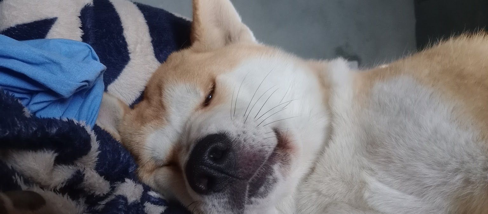

import VideoPlayer from '@/components/ui/VideoPlayer.astro'

Ontem de manhã, enquanto caminhava com meus cachorros pelo bairro ainda silencioso, me peguei pensando numa ironia: passei anos tentando criar disciplina matinal lendo livros de autoajuda, acordando cedo, tomando banho gelado, meditando etc, quando a solução estava o tempo todo andando ao meu lado... literalmente.

Era 21h de uma terça-feira qualquer alguns meses atrás. Eu estava terminando meu segundo trabalho do dia, depois de 13 horas ininterruptas grudado no computador. Hambúrguer congelado no almoço. Energético como lanche. Zero minutos de sol.

Estava vivendo como um vampiro viciado em trabalho.

Atuava como desenvolvedor front-end numa empresa e Product Designer em outra - tudo para ganhar o que já tinha ganhado em um emprego só no passado. A ironia era cruel: quanto mais eu trabalhava, mais eu regredia financeiramente e pessoalmente.

## O loop autodestrutivo perfeito

Minha rotina tinha virado um ciclo que se repetia todos os dias:

* 5h da manhã: soneca mais 15 minutos (que sempre viravam 45). 
* 9h: café da manhã assistindo vídeos no YouTube. 
* 9h30: começar o dia de trabalho. 
* 13h: "almoço" que na verdade era hambúrguer de micro-ondas comido em 5 minutos. 
* 15h: energético com pipoca (minha "refeição" favorita, que vergonha). 
* 21h: encerrar o trabalho, jantar, banho, tentar "relaxar".
* 1h da madrugada: dormir, se tivesse sorte.

E no dia seguinte? **Repetir tudo de novo**.

Não consegui aguentar essa vida por muito tempo. Como sempre acontece comigo (e talvez com você também), comecei a falhar. Desculpas esfarrapadas para uma empresa. Entregas atrasadas na outra. O pior: nenhuma das duas sabia que eu trabalhava para as duas ao mesmo tempo. __Era como ser infiel profissionalmente__.

Resultado óbvio: saí de uma delas. Mais uma vez, eu tinha me sabotado. Mais uma vez, estava recomeçando do zero.

## Os verdadeiros protagonistas desta história

Enquanto eu desmoronava aos poucos, dois seres na minha casa mantinham uma rotina impecável:

* Churros, meu vira-lata de 8 anos, que me acompanha desde sempre. Tranquilo, leal, meu companheiro de trabalho silencioso que fica por perto enquanto eu digito.
* Haru, uma Akita Inu de 2 anos que peguei para fazer companhia ao Churros. Energia pura, disciplina natural, pontualidade japonesa - ela parece ter nascido com um relógio interno preciso.

Eles me seguiam pela casa, ficavam deitados do meu lado enquanto eu trabalhava, brincavam entre si quando eu não dava atenção. Eu os amava profundamente, mas não estava dando a eles - nem a mim - o que merecíamos.

Eu até passeava com eles algumas tardes da semana. Quando lembrava. Quando não estava "muito ocupado sendo produtivo" (que piada).

## A descoberta que mudou tudo

Foi então que algo clicou na minha cabeça.

Eu já tinha lido sobre isso em vários livros famosos de hábitos. A teoria do hábito âncora - aquele hábito que puxa todos os outros como peças de dominó caindo em sequência.

Tentei acordar cedo por semanas. Não colou.
Tentei fazer a cama logo ao levantar. Esquecia no segundo dia.
Tentei meditar assim que acordava. Voltava a dormir no meio.
Tentei ler a Bíblia de manhã. Mesma coisa.

Nada grudava. Nada virava rotina de verdade.

Até que pensei: "E se eu ligasse o acordar cedo com algo que eu realmente QUERO fazer, não algo que eu DEVERIA fazer?"

Foi aí que olhei para o Churros e a Haru, que estavam me encarando com aquela cara de "quando vamos passear de novo?"

## O hábito que funcionou

A fórmula acabou sendo mais simples do que eu imaginava:

5h30 da manhã: acordar e sair IMEDIATAMENTE com os cachorros.

Não era sobre acordar cedo. Era sobre ter uma razão irresistível para sair da cama.

Aqui está o insight que mudou minha vida: cachorros não aceitam desculpas. Eles não negociam. Não deixam você dar mais uma sonecadinha. Quando eles querem sair, querem AGORA. São os melhores personal trainers do mundo - impossível de ignorar.

<VideoPlayer 
  src="/videos/caminhada-com-churros.mp4" 
  caption="Churros aproveitando nossa caminhada matinal"
/>

**Por que esse hábito funcionou onde outros falharam:**

1. Primeiro: o horário é mágico. Das 5h30 às 6h30, a cidade ainda dorme. Poucos carros na rua, poucas pessoas acordadas, só você, seus cachorros e o silêncio da madrugada.
2. Segundo: vitamina D matinal. Aquele sol suave que meu corpo estava implorando há meses, depois de passar dias inteiros trancado em casa.
3. Terceiro: despertar natural. Caminhada com ar fresco funciona melhor que qualquer café para me deixar esperto.
4. Quarto: sensação de conquista logo cedo. Antes das 7h da manhã, eu já tinha feito algo importante e bom para mim.
5. Quinto: tempo de qualidade real. 30 a 45 minutos só meus e deles, sem notificação do celular, sem reunião, sem pressa para lugar nenhum.

## O efeito dominó que eu não esperava

O passeio virou minha âncora. Quando voltava para casa, eu já estava "ligado" e no clima para fazer outras coisas boas:

* Anotações de gratidão num caderninho que comprei.
* Planejamento do dia, colocando as prioridades no papel.
* Leitura espiritual pelo aplicativo que baixei.
* Ler pelo menos 10 páginas de algum livro.
* Café da manhã de verdade (ainda assistindo YouTube, mas pelo menos comendo direito).

_Bonus: durante a caminhada, comecei a ouvir podcasts sobre trabalho e notícias. Aprendizado + exercício + tempo com os cachorros = combinação perfeita._

## O teste que provou que não era sobre acordar cedo

Aqui está a prova de que acordar cedo não era o verdadeiro segredo:

Nos fins de semana, eu acordo às 7h, 8h da manhã. Bem mais tarde. Mas ainda assim faço o passeio matinal com eles.

E sabe o que acontece? Toda a sequência de hábitos bons continua funcionando perfeitamente.

A mágica não estava no horário. Estava na ação que eu genuinamente queria fazer, que me dava prazer imediato.

## A diferença entre obrigação e vontade

**Obrigação**: "Preciso acordar às 5h30 porque li que pessoas bem-sucedidas fazem isso."

**Vontade**: "Churros e Haru estão me esperando, e eu sei que vou me sentir bem depois."

Adivinha qual das duas funciona melhor?

## O plot twist: não é sobre os cachorros

Esse texto não é um manual sobre "como cachorros podem salvar sua vida" (embora possam, e muito).

É sobre encontrar SEU hábito âncora. Aquela coisa que você realmente quer fazer, não que você acha que deveria fazer.

Qualquer coisa que faça você pensar "nossa, que bom que eu fiz isso" logo depois.

## As regras que descobri para hábitos que realmente grudam

1. **Primeiro**: tem que ser algo que você gosta de verdade, não que apenas tolera.
2. **Segundo**: tem que dar uma sensação boa imediata, na hora mesmo.
3. **Terceiro**: tem que ser simples - sem equipamentos caros ou preparação complicada.
4. **Quarto**: tem que ser genuinamente SEU, não o que funciona para fulano famoso do Instagram.

A grande lição que aprendi: não tente mudar sua vida inteira de uma vez. Não force hábitos que "deveriam" funcionar segundo os especialistas. Encontre UMA coisa que você genuinamente quer fazer e use ela como âncora para todo o resto.

Para mim, foram meus dois companheiros peludos. Para você, vai ser o quê?

---

*Se esse texto fez sentido para você, compartilhe com alguém que também está há meses tentando "se organizar" sem sucesso. Às vezes, a solução é mais simples (e mais peluda) do que imaginamos.*

*E se você descobrir seu hábito âncora, me conta. Adoro histórias de pequenas revoluções pessoais.*

*P.S.: Churros e Haru aprovam esta mensagem.*